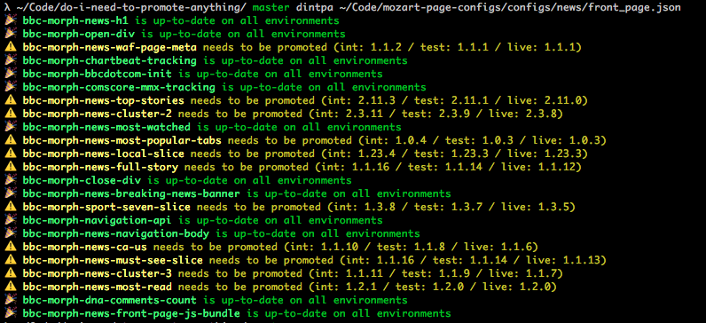
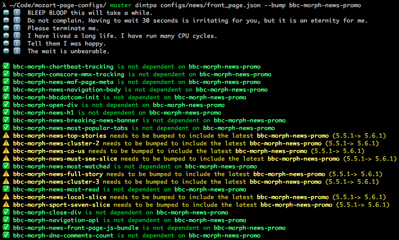

# Do I need to promote anything?

I have this Mozart config full of Morph modules and I want to know whether any of the modules need to be promoted!

## Install

> **Heads up!** You'll need Node v6 or higher for this to work.

```
git clone git@github.com:BBC-News/do-i-need-to-promote-anything.git
cd do-i-need-to-promote-anything/
npm install
npm link
```

## Usage

### Find out which components need to be promoted

```
dintpa path/to/mozart/config.json
```



### Find out which components need to be bumped to include the latest version of a dependency

```
dintpa path/to/mozart/config.json --bump name-of-module
```


