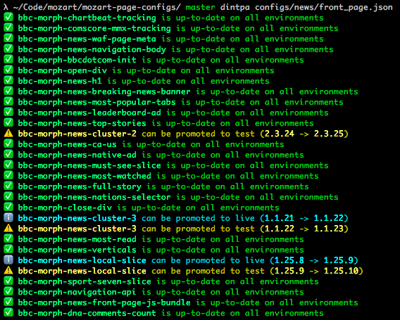

# Do I need to promote anything?

I have this Mozart config full of Morph modules and I want to know whether any of the modules need to be promoted!

## Install

```
git clone git@github.com:BBC-News/do-i-need-to-promote-anything.git
cd do-i-need-to-promote-anything/
npm install
npm link
```

## Usage

```
dintpa path/to/mozart/config.json
```


